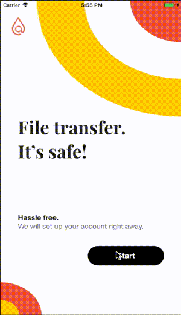

### Now for a little internet optimism

# atsign_atmosphere_app

Makes peer-to-peer encrypted file sharing possible. In real-time, you can send files across any device regardless of your location — with the added benefit of total privacy. You can fearlessly share contracts, tax information, or other confidential information without worrying about your data being stored on a server in the cloud. 

To see a demonstration of @mosphere, refer to the GIF below:

## Creating your own @platform data-streaming application

Just like any Flutter app, an @platform application requires a little bit of setup before you can get started. Here are those steps:

1. Add the service file to your app: You can simply copy this service file from our demo [at_hello_world](https://github.com/atsign-foundation/at_demos/tree/master/at_hello_world) application. These files contain helper methods that allow you to implement @protocol functionality with just a couple lines of code. 
2. Add the configuration file to your app: Again, feel free to copy this from the [at_hello_world](https://github.com/atsign-foundation/at_demos/tree/master/at_hello_world) and @mosphere application. This file contains variables that allow you to use the virtual environment. Make sure that the ROOT_DOMAIN string is set to vip.ve.atsign.zone and you have a unique name for the NAMESPACE of your @pp!
3. Copy the dependencies from the [at_hello_world](https://github.com/atsign-foundation/at_demos/tree/master/at_hello_world) and @mosphere pubspec.yaml files and put them into your project.

We are super glad that you are beginning your journey as an @dev. We highly recommend that you join our discord dev community for troubleshooting, dev updates, and much more! 

